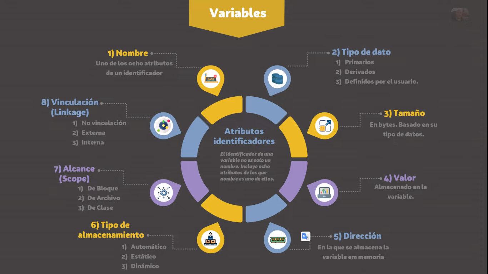
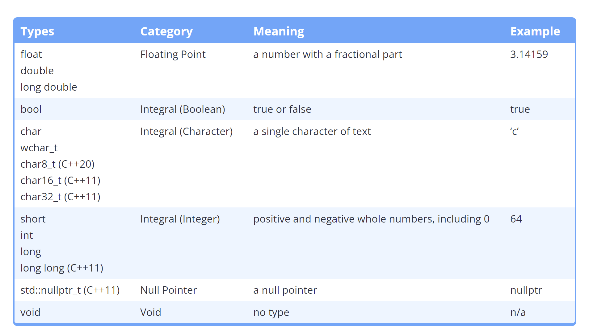
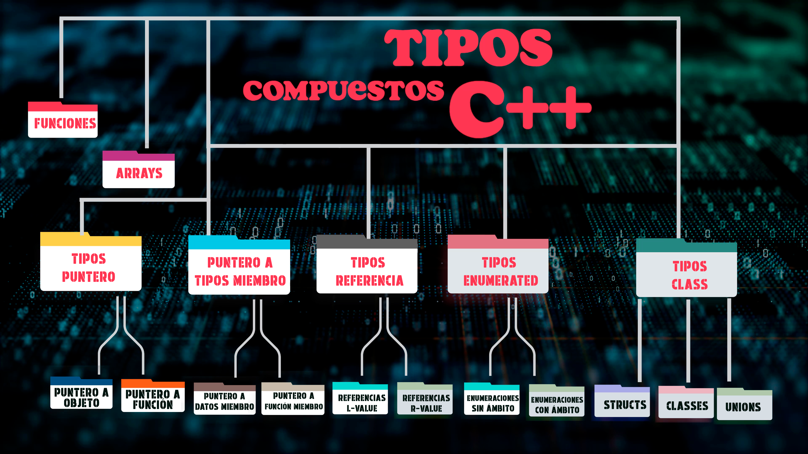
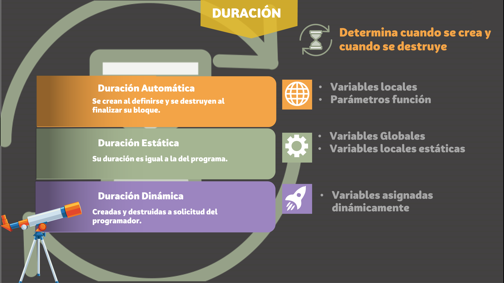
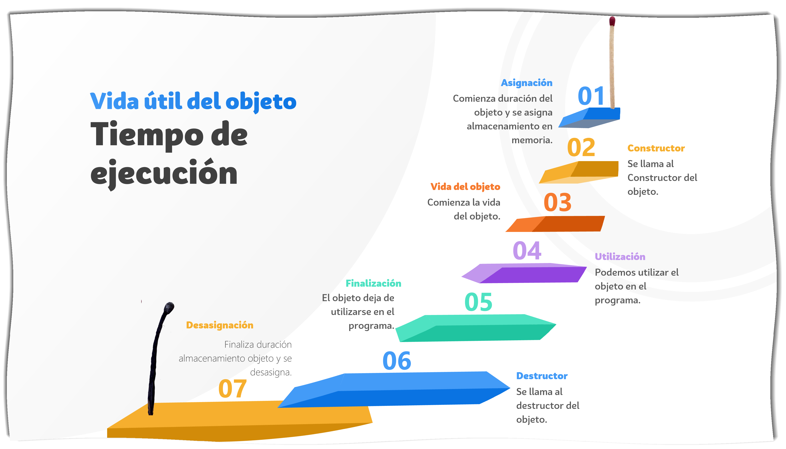

# C++

```c++
#include <iostream>
#include <vector>
#include <functional>
#include <cassert>
#include "temas/Temas.h"
#include "sumar/Sumar.h"
#include "namespaces/Uno.h"
#include "namespaces/Dos.h"
#include "constantes/Constantes.h"
#include "constantes/ConstantesInline.h"
#include "estructuras/Vehiculo.h"
#include "clases/fecha/Fecha.h"
#include "clases/fraccion/Fraccion.h"
#include "clases/simple/Simple.h"
#include "clases/calculadora/Calculadora.h"
#include "clases/copiaprofunda/ClaseConCopiaSuperficial.h"
#include "clases/copiaprofunda/ClaseConCopiaProfunda.h"


int main() {
    claseConCopiaProfunda();
    return 0;
}

ClaseConCopiaProfunda funcionCopiaProfunda(ClaseConCopiaProfunda clase) {
    return clase;
}

void claseConCopiaProfunda() {
    ClaseConCopiaProfunda clase{4};
    clase.setValor(0, 1);
    clase.setValor(1, 2);

    auto copia = funcionCopiaProfunda(clase);
    copia.setValor(1, 5);

    std::cout << clase.getValor(1) << std::endl; // 5
};

ClaseConCopiaSuperficial funcionCopiaSuperficial(ClaseConCopiaSuperficial clase) {
    return clase;
}

void claseConCopiaSuperficial() {
    ClaseConCopiaSuperficial clase{4};
    clase.setValor(0, 1);
    clase.setValor(1, 2);

    //Internamente solo se copia la dirección del array
    auto copia {funcionCopiaSuperficial(clase) };
    copia.setValor(1, 5);

    std::cout << clase.getValor(1) << std::endl; // 5
}

void claseConCopiaSuperficialError() {
    ClaseConCopiaSuperficial clase{4};
    clase.setValor(0, 1);
    {
        auto copia{ clase };
    } //Ya que internamente solo se copia la dirección del array,
      // al llamar al destructor se elimina la memoria para ambos dejando un puntero colgante
    std::cout << clase.getValor(0) << std::endl;
}

void calculadoraBuilder() {
    Calculadora calculadora{};
    auto resultado = calculadora.sumar(3).restar(1).getValor();

    std::cout << resultado << std::endl;
}

void punteroOcultoThis() {
    Simple simple{1};
    simple.setId(3);
    /*
     El compilador convierte 'simple.setId(3)' en:

     setId(&simple, 3);

     void setId(Simple* const this, int nid) {
        this->id = nid;
     }
     */

    std::cout << "-> " << simple.getId() << std::endl;
}

// Se llama 2 veces el constructor por copia, al pasar y al retornar el valor
Fraccion pasoYRetorno(Fraccion fraccion) {
    std::cout << "-> " << fraccion.getNumerador() << std::endl;
    return fraccion;
}

void pasoYRetornoPorValor() {
    Fraccion fraccion{3, 2};
    Fraccion resultado = pasoYRetorno(fraccion);
}

void constructorPorCopia() {
    Fraccion fraccion1 {5};                     //Inicialización uniforme
    Fraccion fraccion2 { fraccion1 };                     //Llama el constructor por copia
    std::cout << fraccion1.getNumerador() << std::endl;
}

void claseFecha() {
    Fecha fecha(10, 9, 2008);
    std::cout << " - " << fecha.getAnio() << std::endl;
}

class ClaseConDestructor {
private:
    int* array{};
    int size{};

public:
    ClaseConDestructor(int size) : size(size) {
        assert(size > 0);
        array = new int[static_cast<std::size_t>(size)]{};
    }

    ~ClaseConDestructor() {
        delete[] array;
    }

    void serValor(int indice, int valor) { array[indice] = valor; }
    int getValor(int indice) { return array[indice]; }
    int getSize() { return size; }
};


void destructoresClases() {
    ClaseConDestructor clase(5);
    clase.serValor(3, 9);

    std::cout << "-> " << clase.getValor(3) << std::endl;
}

class C {
    int valor{};
public:
    C(int valor = -1) : valor(valor) {}

    void imprimir() {
        std::cout << "-> " << valor << std::endl;
    }

    void reset() {
        *this = C(0);
    }
};

void clasesMiembrosNoStatic() {
    C c1{};
    c1.imprimir();

    C c2{ 9 };
    c2.imprimir();
    c2.reset();
    c2.imprimir();
}


class B {
    const int bValue{};
public:
    B(const int y = 0) : bValue{ y } { std::cout << "B " << y << std::endl; }
};

class A {
    const B bClass{};
public:
    A(const int x) : bClass { x - 1 } { std::cout << "A " << x << std::endl; }
};


class ClaseA {
private:
    const int numero{};
    const int otro{};

public:
    ClaseA(int numero, int otro = 0) : numero(numero), otro(otro) {}

    void imprimir() {
        std::cout << numero << " - " << otro << std::endl;
    }
};

void inicializacionClases() {
    ClaseA claseA{9};
    claseA.imprimir();

    A a{ 5 };
    std::cout << "end"<< std::endl;
}

class VehiculoC {

public:
    int id {};
    std::string nombre {};
    int velocidad { 100 };

    void imprimir() {
        std::cout << nombre << ": " << id << std::endl;
    }
};

void clases() {
    VehiculoC vehiculo { 1, "xxx", 120 };
    vehiculo.imprimir();
}

void lambdasClausulaCaptura() {
    int buscar { 4 };
    auto x { [buscar](int n) { return n == buscar; } }; //Crea una variable clonada con el mismo valor
    auto y { [buscar](int n) mutable { return n == ++buscar; } }; //No modifica la variable original
    auto z { [&buscar](int n) { return n == ++buscar; } }; //Modifica la variable original

    //Capturas predeterminadas
    auto u { [=](int n) { return n == buscar; } }; //Captura por copia (=)
    auto w { [&](int n) { return n == buscar; } }; //Captura por referencia (&)
    // [&]  [=, &x]   [&, =x]

    std::vector<int> v {7, 2, 1, 4, 5};
    auto res1 { std::find_if(v.begin(), v.end(), [&buscar](const auto& n) { return n == buscar; }) };
    int r1 { res1 == v.end() ? 0 : *res1 };

    auto res2 { std::find_if(v.begin(), v.end(), [&](auto n) { return n == buscar; }) };
    int r2 { res1 == v.end() ? 0 : *res1 };

    std::cout << "end!" << std::endl;
}

void lambdas() {
    auto x = []() {};
    auto y { [](int n) -> bool { return n == 4; } };  //El compilador genera un tipo unico para ella
    std::function z { [](int n) { return n == 4; } };  //Se puede almacenar en std::function

    std::vector<int> v {7, 2, 1, 4, 5};
    auto res1 { std::find_if(v.begin(), v.end(), [](int n) { return n == 4; }) };
    int r1 { res1 == v.end() ? 0 : *res1 };

    std::cout << "end!" << std::endl;
}

bool primeroMayor(int x, int y) {
    return x > y;
}

void stdFunction() {
    std::function<bool(int, int)> ptrFunction1 { primeroMayor };
    bool resultado1 { ptrFunction1(2, 1) };

    auto ptrFunction2 { primeroMayor };
    bool resultado2 { ptrFunction1(2, 1) };

    std::cout << resultado1 << " " << resultado2 << std::endl;
}

bool funcionComoArgumento(bool (*fn)(int, int)) {
    return fn(2, 3);
}

void funcionesComoArgumentos() {
    bool resultado { funcionComoArgumento(primeroMayor) };
    std::cout << resultado << std::endl;
}

int funcionEjemplo(int x) {
    return x + 1;
}

int *funcionEjemplo2();  //Declaración anticipada de una función

void punterosDeFunciones() {
    int res1 { (*funcionEjemplo)(2) }; //Ejecutar función por medio de su dirección en memoria

    int (*ptrFuncion)(int) { &funcionEjemplo };  //Puntero a función
    int res2 { ptrFuncion(3) };

    int (*ptrFuncionNula)(int) { nullptr };

    std::cout << "end!" << std::endl;
}

void busquedas() {
    std::vector<int> v {7, 2, 1, 4, 5};

    auto existe { std::find(v.begin(), v.end(), 4) };
    std::string r1 { existe == v.end() ? "error" : "ok" };

    auto noexiste { std::find(v.begin(), v.end(), 10) };
    std::string r2 { noexiste == v.end() ? "error" : "ok" };

    std::cout << "end!" << std::endl;
}

void vectorMap() {
    std::vector<int> v {1, 2, 3, 4, 5};
    std::vector<int> n;

    transform(
            v.begin(),
            v.end(),
            back_inserter(n),
            [] (int i) { return i * 2; }
    );
}

void vectorFilter() {
    std::vector<int> v {1, 2, 3, 4, 5};
    std::vector<int> n;
    copy_if(
            v.begin(),
            v.end(),
            back_inserter(n),
            [] (int i) { return i % 2 == 0; }
    );
    std::cout << n.size() << std::endl;
}

//Vector se autolimpia cuando sale de alcance
void stdVector() {
    std::vector<int> miVector {3, 2, 4};
    miVector[2];   //No comprueba limites
    miVector.at(2); //Comprueba limites

    miVector.size();

    miVector.resize(5);

    miVector.begin();
    miVector.end();

    vectorMap();
    vectorFilter();
}

//Arrays fijos
void stdArray() {
    std::array miArray {3, 2, 4};
    std::cout << miArray.at(1) << std::endl;

    std::sort(miArray.begin(), miArray.end());
    for (auto n : miArray)
        std::cout << n << std::endl;
}

void punterosVoid() {
    int valor { 5 };
    void* voidPtr { &valor };

    int* intPrt { static_cast<int*>(voidPtr) };
    std::cout << *intPrt << std::endl;
}

void loopForEach() {
    const std::string textos[] {"aaa", "bbb", "ccc", "ddd"};
    for (const auto& texto : textos) {
        std::cout << texto << std::endl;
    }
}

void asignacionDinamicaArrays() {
    int size {};
    std::cout << "Numero...";
    std::cin >> size;

    int* array { new int[size]{} };
    delete[] array;
    std::cout << "end" << std::endl;
}

void asignacionDinamicaMemoria() {
    int* x { new int };
    std::cout << x << std::endl; //0x562ff18e7eb0
    *x = 9;
    std::cout << *x << std::endl;

    delete x;
    std::cout << x << std::endl; //0x562ff18e7eb0
    x = nullptr;
    std::cout << x << std::endl; //0
}

void arimeticaDePunteros() {
    int array[]{ 7, 8, 9};
    std::cout << &array[0] << std::endl; //0x7ffc092a5dbc
    std::cout << &array[1] << std::endl; //0x7ffc092a5dc0
    std::cout << &array[2] << std::endl; //0x7ffc092a5dc4

    std::cout << "---" << std::endl;
    std::cout << array << std::endl;     //0x7ffc092a5dbc
    std::cout << array + 1 << std::endl; //0x7ffc092a5dc0
    std::cout << array + 2 << std::endl; //0x7ffc092a5dc4
    std::cout << "---" << std::endl;
    std::cout << std::begin(array) << std::endl; //0x7ffc092a5dbc
    std::cout << std::end(array) << std::endl;   //0x7ffc092a5dc8

    std::cout << array[2] << std::endl;     //9
    std::cout << *(array + 2) << std::endl; //9

    int length { static_cast<int>(std::size(array)) };
    for (int* ptr{ array }; ptr != (array + length) ; ++ptr) {
        std::cout << *ptr << std::endl;
    }
}

struct Usuario {
    int id {};
    std::string nombre {};
};

void seleccionDeMiembros() {
    Usuario usuario {1, "mmm"};

    Usuario* ptr { &usuario };

    std::cout << ptr->nombre << std::endl;
    std::cout << (*ptr).nombre << std::endl;
}

void imprimirUsuario(Usuario& usuario) {
    std::cout << usuario.id << " " << usuario.nombre << std::endl;
}

void estructuras() {
    Usuario usuarioCero;
    Usuario usuario {1, "mmm"};

    Vehiculo vehiculo {2, "yyy"};

    std::cout << usuario.nombre << std::endl;
    imprimirUsuario(usuario);
}

const std::string& menorPorReferencia(const std::string& x, const std::string& y) {
    return x < y ? x : y;
}

void retornoPorReferencia() {
    const std::string x { "c" };
    const std::string y { "b" };
    auto& z = menorPorReferencia(x, y);
    std::cout << z << std::endl;
}

void anularInvalido(int* ptr) {
    ptr = nullptr; // Modifica a que apunta el puntero
}

void anularValido(int*& ptr) { //Referencia a un puntero
    ptr = nullptr;
}

void pasoPunteroPorRef() {
    int x { 9 };
    int* ptr { &x };
    std::cout << (ptr ? *ptr : 0)  << std::endl;
    //anularInvalido(ptr);
    anularValido(ptr);
    std::cout << (ptr ? *ptr : 0)  << std::endl;
}

void imprimirRefYPuntero(const std::string& x, const std::string* y) {
    std::cout << "Direcc.referencia " << &x << std::endl; //0x7ffe7b2a9a40
    std::cout << "Dirección puntero " << y << std::endl;  //0x7ffe7b2a9a40
    std::cout << "Dir mem del punt. " << &y << std::endl; //0x7ffe7b2a9a10
}

void pasoPorRefYDirecc() {
    std::string texto { "mmm" };
    std::cout << "Dirección memoria " << &texto << std::endl; //0x7ffe7b2a9a40

    imprimirRefYPuntero(texto, &texto);
}

//Paso por copia del puntero
void imprimirPorDireccion(const std::string* ptr) {
    // Validar que el puntero no sea nulo
    std::cout << *ptr << std::endl;
}

void pasoPorDireccion() {
    std::string texto { "Hello" };
    imprimirPorDireccion(&texto);
}

void punterosColgantes() {
    int* ptr{ };
    {
        int x { 5 };
        ptr = &x;
    }
    std::cout << *ptr << std::endl;
}

void punterosNulos() {
    int* ptr {};
    std::cout << ptr << std::endl;

    int x { 3 };
    ptr = &x;
    std::cout << *ptr << std::endl;

    int* ptrNull { nullptr };
    //std::cout << *ptrNull << std::endl;   ->   (Comportamiento indefinido)

    if (ptrNull)
        std::cout << *ptrNull << std::endl;

    int res { ptrNull ? *ptrNull : 0 };

    std::cout << "end!!!" << std::endl;
}

struct S {
    double x, y, z;
};

#define isSmall(T) (sizeof(T) <= 2 * sizeof(void*))
void evaluarCostoPasoPorReferencia() {
    std::cout << std::boolalpha;
    std::cout << isSmall(int) << " " << sizeof(int) << std::endl;
    std::cout << isSmall(double) << " " << sizeof(double) << std::endl;
    std::cout << isSmall(S) << " " << sizeof(S) << std::endl;
    std::cout << isSmall(std::string) << " " << sizeof(std::string) << std::endl;
}

void imprimirTextoPorRef(const std::string& t) {
    std::cout << t << std::endl;
}

void pasoPorValor(int x) {
    ++x;
}

void pasoPorReferencia(int& x) {
    ++x;
}

void pasoPorReferenciaYValor() {
    int x { 5 };
    pasoPorValor(x);
    std::cout << "x: " << x << std::endl;

    pasoPorReferencia(x);
    std::cout << "x: " << x << std::endl;

    std::string name = "mmm";
    imprimirTextoPorRef(name);
}

void punteros() {
    int x { 1 };

    //Operador de dirección & -> Retorna direccíon en memoria (El 1er byte que ocupa)
    int* puntero { &x };
    std::cout << "Dirección: " << puntero << std::endl;

    //Operador de indirección *
    int valor { *puntero };
    std::cout << "Valor: " << valor << std::endl;

    int w = *(&x);

    //Referencias int&   (alias para un objeto)
    int& ref = x;
    x = 3;
    std::cout << "Valor: " << ref << std::endl; //3

    // Favorecer las referencia sobre los punteros
}

void funcionArray(int* array) {
    std::cout << "Dirección: " << array << std::endl;
    std::cout << "1er valor: " << *array << std::endl;
}

void decaimientoAPuntero() {
    int numeros[] {9, 8, 7};

    funcionArray(numeros);

    std::cout << "Dirección: " << numeros << std::endl;
    std::cout << "1er valor: " << *numeros << std::endl;
}

void arrayMultidimencional() {
    int array[][2] {
            {1,2},
            {3,4},
    };
}

void swapStd() {
    auto x { 5 };
    auto y { 2 };
    std::swap(x, y);
    std::cout << x << " " << y << std::endl;
}

enum Estado {
    Activo,     // 0
    Suspendido, // 1
    Inactivo,   // 2
    maximo      // 3
};

void enums() {
    std::cout << Estado::Inactivo << std::endl;
}

void arrays() {
    int numeros[10] {9, 8, 7};
    int numeros3[] {9, 8, 7};

    std::cout << "Size: " << std::size(numeros3) << std::endl;
    for (int i { 0 }; i < std::size(numeros3); ++i) {
        std::cout << numeros3[i] << std::endl;
    }
}

template <typename T>
T mayor(T x, T y) {
    return (x > y) ? x : y;
}

template <typename T, typename U>
T mayorv2(T x, U y) {
    return (x > y) ? x : y;
}

template <typename T, typename U>
auto mayorv3(T x, U y) {
    return (x > y) ? x : y;
}

auto mayorv4(auto x, auto y) {
    return (x > y) ? x : y;
}

void templatesFunciones() {
    // Hace uso de sobrecarga de funciones en tiempo de compilación
    auto x { mayor(2.1, 2.05) };
    auto y { mayor<int>(3.5, 3) };
    auto z { mayor<>(5, 3) };

    auto w { mayorv4(5.0, 3) };

    std::cout << x << y << std::endl;
}

int sumaPredeterminado(int x, int y = 0) {
    return x + y;
}

void argumentoPredeterminado() {
    std::cout << sumaPredeterminado(5) << std::endl;
}

int sumaSobrecargada(int x, int y) {
    return x + y;
}

double sumaSobrecargada(double x, double y) {
    return x + y;
}

void sobrecargaFunciones() {
    auto r { sumaSobrecargada(1.0, 2.0) };
}

// auto autoSuma(int x, auto y) -> int {
auto autoSuma(int x, int y) {
    return x + y;
}

void infereciaTipos() {
    // Eliminara const de los tipos inferidos
    const int x { 5 };
    auto y { x };
    const auto z { x };

    // Eliminara las referencias de los tipos inferidos
    int a { 5 };
    int& ra { a };
    auto b { ra };   // int
    auto& c { ra };   // int&

    using namespace std::literals;
    auto nombre { "Mauricio"s };

    auto w { autoSuma(1, 2) };

    std::cout << "end!" << std::endl;
}


void conversionesExplicitas() {
    int x { 10 };
    int y { 4 };

    double a { (double) x / y };
    double b { double (x) / y };

    //static_cast: Verificación de tipos en tiempo de compilación
    double c { static_cast<double>(x) / y };

    std::cout << "end!" << std::endl;
}

void usoGoto() {
    int numero{};
    deNuevo:
    std::cout << numero << std::endl;
    if (numero < 5) {
        ++numero;
        goto deNuevo;
    }
}

void excepciones() {
    try {
        throw 9;
    } catch (int n) {
        std::cout << "Error " << n << std::endl;
    }
}

void variablesInline() {
    // Variables constantes compartidas
    std::cout << constantes::pi << std::endl;
    std::cout << constantesinline::pi << std::endl;
}

// Variable global (Alcance de archivo) Pueden ser inicializadas después si no son const
constexpr int g_global { 9 };
extern constexpr int g_global_externa { 11 };

void vinculacion() {
    /*
      Variables globales no const tienen vinculación externa pero podemos darles vinculación interna con la palabra clave static.
      Variables globales constantes tiene vinculación interna, podemos darles vinculación externa con la palabra clave extern.
    */
    std::cout << g_global_externa << std::endl;
}

void variablesGlobales() {
    std::cout << g_global << std::endl;
}

void namespaces() {
    // :: Operador de resolución de alcance
    std::cout << uno::algo(4, 2) << std::endl;
    std::cout << dos::algo(4, 2) << std::endl;
}

void constantesTiempoCompilacion() {
    constexpr int suma { 1 + 2 };
    std::cout << suma << std::endl;
}

void variablesConstantes(const int x) {
    //x = 1; Error
    const int y { 9 };
}

void cadenas() {
    std::string nombre { "Mauricio" };
    std::cout << nombre << " " << nombre.length() << std::endl;
}

void conversionTipos() {
    double x { 5.5 };
    int y = static_cast<int>(x);
    std::cout << "Numero: " << y << std::endl;

    int a = (int) x;
    std::cout << "Numero: " << a << std::endl;
}


void tiposFundamentales() {
    std::cout << "bool: \t\t" << sizeof(bool) << "bytes\n";
    std::cout << "char: \t\t" << sizeof(char) << "bytes\n";
    std::cout << "wchar_t: \t" << sizeof(wchar_t) << "bytes\n";
    std::cout << "char16_t: \t" << sizeof(char16_t) << "bytes\n";
    std::cout << "char32_t: \t" << sizeof(char32_t) << "bytes\n";
    std::cout << "short: \t\t" << sizeof(short) << "bytes\n";
    std::cout << "int: \t\t" << sizeof(int) << "bytes\n";
    std::cout << "long: \t\t" << sizeof(long) << "bytes\n";
    std::cout << "long long: \t" << sizeof(long long) << "bytes\n";
    std::cout << "float: \t\t" << sizeof(float) << "bytes\n";
    std::cout << "double: \t" << sizeof(double) << "bytes\n";
    std::cout << "long double: " << sizeof(long double) << "bytes\n";
}

void headers() {
    auto resultado { sumar(1, 2) };
    std::cout << ":" << resultado << std::endl;
}

void asignacion() {
    int a;               // Sin inicializador
    int b = 8;           // Inicialización por copia
    int c ( 6 );         // Inicialización directa
    int d = { 9 };       // Inicialización uniforme (El compilador nos avisa de posibles errores)
    int e = {};          // Inicialización de valor  // 0
    std::cout << "Inicialización" << std::endl;
}
```

### Variables


### Clasificación de operadores


### Prioridad operadores


### Tipos de datos fundamentales


### Tipos compuestos


### Alcance


### Duración


### Vinculación


### Vida útil


### Generic containers


###### Imágenes tomadas del curso de c++ de Jesús Conde
